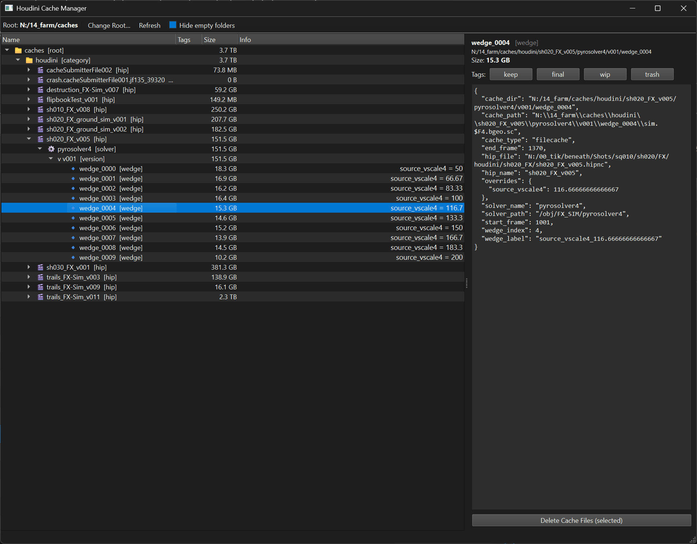

# cacheManager

A small desktop GUI (PySide6) for managing **Houdini render-farm caches**. Built for a
student film pipeline, where simulation caches pile up fast and disk space disappears.

It scans your cache folder, shows it as a tree, lets you **tag** folders (keep / final / wip /
trash), computes folder sizes in the background, and **deletes the heavy cache files** while
preserving the folder structure, descriptor files, and anything you marked to keep.



## Features

- **Tree view** of the cache, colour-coded by tag (green = protected/keep, red = trash,
  blue = final).
- **Tagging** — toggle `keep`, `final`, `wip`, `trash` on any selection (tags are configurable).
- **Background size computation** so the UI stays responsive on huge caches; right-click any
  subtree to prioritise computing its size.
- **Safe delete** — removes cache files but keeps the folder tree and `*.json` descriptors, and
  never touches anything tagged `keep` (or whatever you set as a protected tag).
- **Hide empty folders** filter.

## Expected cache layout

The scanner understands a Houdini-style cache hierarchy and labels each level:

```
<cache_root>/
└── houdini/            (category)
    └── <hipname>/      (hip)
        └── <solver>/   (solver)
            └── v001/   (version)
                └── wedge_0000/   (wedge)  ← may contain a wedge_*.json with parameters
```

Folders matching `vNNN` are versions and `wedge_N` are wedges; anything else is shown as a
generic folder, so it still works if your layout differs.

## Requirements

- Python 3.10+
- PySide6 (`pip install -r requirements.txt`)

## Setup & run

```bash
pip install -r requirements.txt
run.bat            # Windows — launches the GUI
# or:
python main.py
```

On first launch the cache root is empty — click **“Change Root…”** in the toolbar and pick your
cache folder. Your choice is saved to `config.json`.

## Configuration (`config.json`)

| Key | Meaning |
|---|---|
| `cache_root` | Folder to scan (also settable from the UI) |
| `preserve_extensions` | File extensions never deleted (default `.json` descriptors) |
| `available_tags` | The tag buttons shown in the UI |
| `protected_tags` | Tags that block deletion (default `keep`) |

Tags themselves are stored separately in `metadata.json`, which is created on first use and is
git-ignored (it holds absolute cache paths specific to your machine).